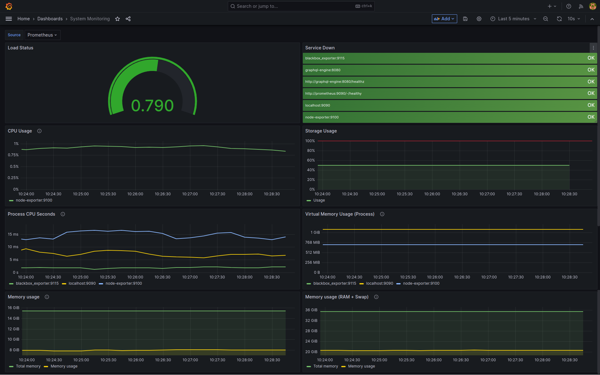
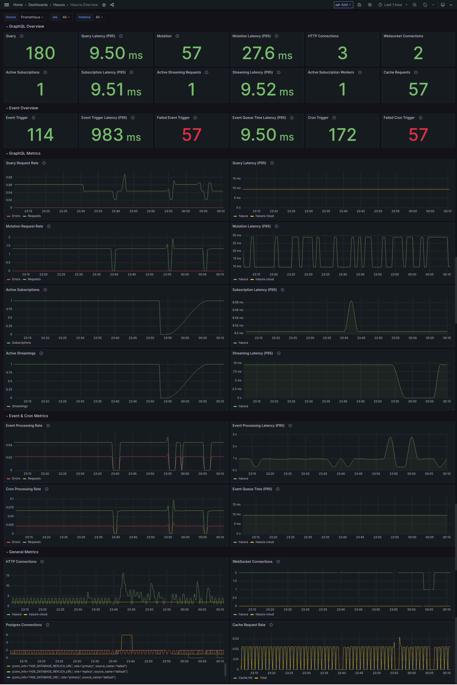
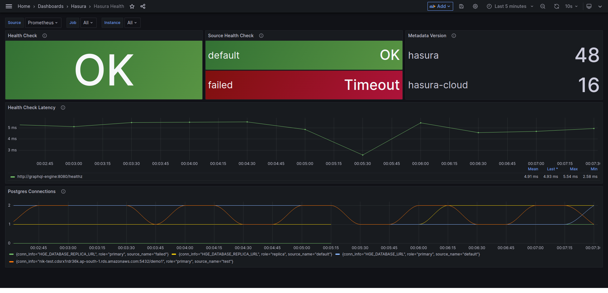
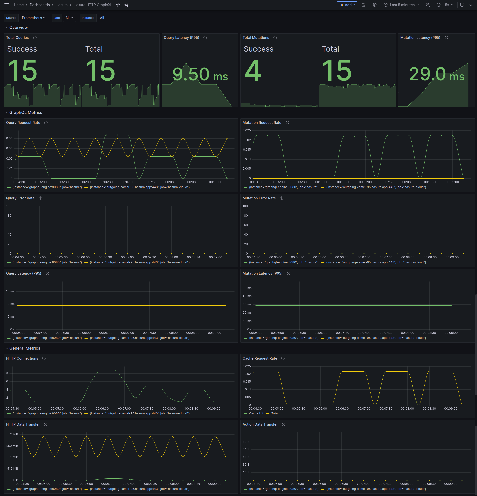
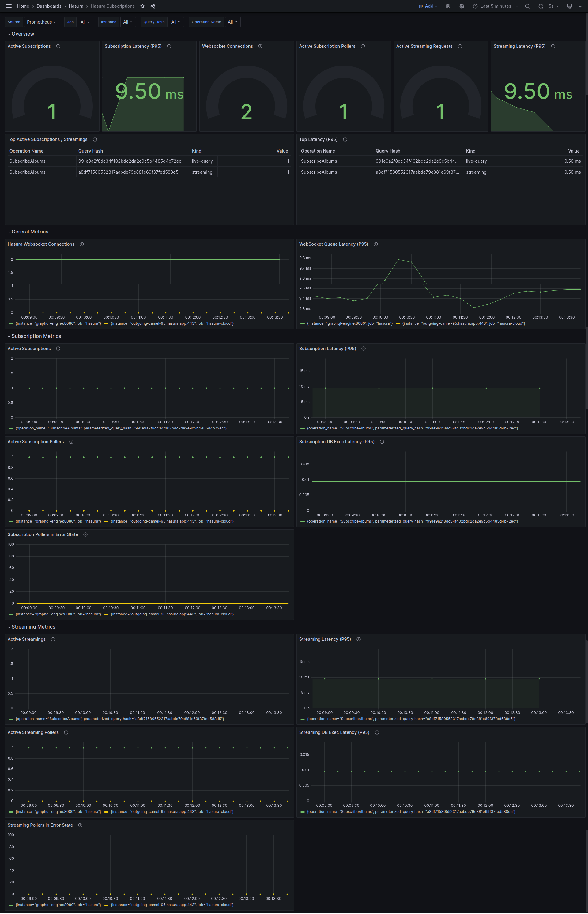
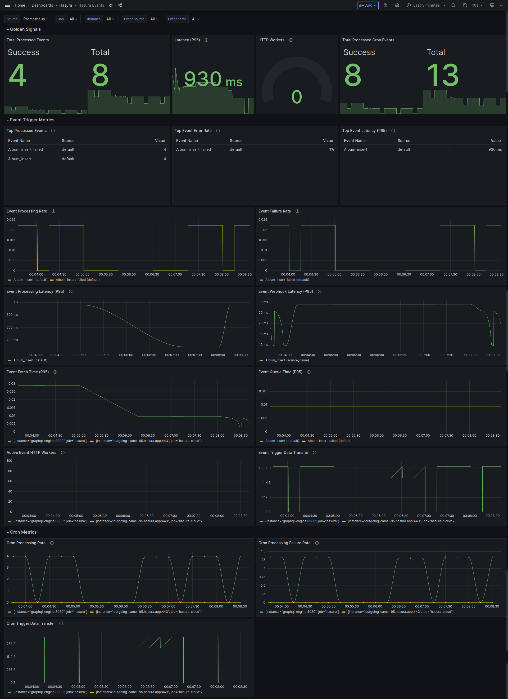
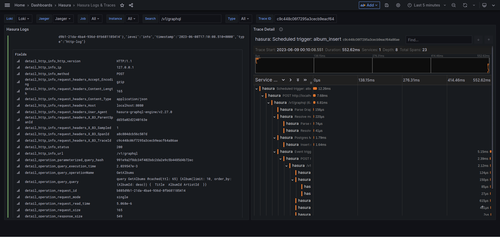
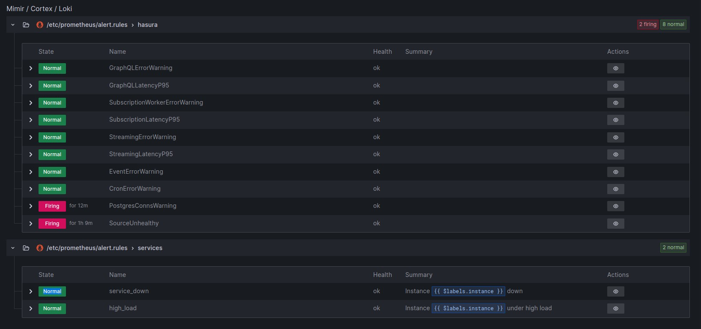

# Hasura Enterprise Observability Demo

This demo is made to showcase working of alertmanager and prometheus with Hasura. There is a node-server service which will listen to alerts from alertmanager.

The alert rules are defined in `prometheus/alert.rules` file.

This project is only scoped to show you alertmanager demo and how alerts are configured which can be recieved over custom backend webhook URL.

You can either extract the functionality from this demo and merge it with rest of your observability setup. You can also run other services in parallel/conjunction to alertmanager such as blackbox exporter, promtail or any other service.

## Get Started

- Copy `dotenv` to `.env` and configure secrets and EE License Key.
- Try `docker-compose` locally with `docker-compose up -d`, or run the Docker Swarm stack with scripts that are in the `util` folder.

## List of important metrics 
- hasura_graphql_requests_total (No of hasura graphql requests in time-series fashion). [docs](https://hasura.io/docs/latest/observability/enterprise-edition/prometheus/metrics/#hasura-graphql-requests-total)
- hasura_postgres_connections (No of PG connections opened by Hasura). [docs](https://hasura.io/docs/latest/observability/enterprise-edition/prometheus/metrics/#hasura-postgres-connections)
- hasura_graphql_execution_time_seconds (The execution time in seconds). [docs](https://hasura.io/docs/latest/observability/enterprise-edition/prometheus/metrics/#hasura-graphql-execution-time-seconds)
- hasura_http_connections (The no. of active HTTP connections representing the HTTP load on the server ). [docs](https://hasura.io/docs/latest/observability/enterprise-edition/prometheus/metrics/#hasura-http-connections)

In case you are using subscriptions (over websocket connections)
- hasura_websocket_connections (Current number of active WebSocket connections, representing the WebSocket load on the server). [docs](https://hasura.io/docs/latest/observability/enterprise-edition/prometheus/metrics/#hasura-websocket-connections)

### how to configure/tweak the alert rules

For example, lets say we want to tweak this expression of `HighGraphQLRequestsWarning` alert
```
increase(hasura_graphql_requests_total[1m]) > 10
```

To breakdown
- hasura_graphql_requests_total[1m]: This part of the expression queries a metric called hasura_graphql_requests_total. The [1m] part specifies that it's looking at data over a 1-minute window. Essentially, it's calculating the rate of increase in the number of requests per minute.

- increase(): This function calculates the increase in the value of a metric over a given time range. In this case, it's looking at the increase in the number of GraphQL requests over the last 1 minute.

- `> 10`: This condition checks if the increase in the number of GraphQL requests over the last minute is greater than 10.

Suppose your on avg. hourly traffic is 10000 requests. The fluctuations can happen between 10-15K. 

But if you want to set alert if it crosses the threshold of 20000 requests per hour , then you can do something similar expression
```
increase(hasura_graphql_requests_total[1h]) > hasura_graphql_requests_total[2h]
```
or if want a shorter duration
```
increase(hasura_graphql_requests_total[30m]) > hasura_graphql_requests_total[1h]
```

### Key Alertmanager Functions to use in alert rules

#### `increase ()` (https://prometheus.io/docs/prometheus/latest/querying/functions/#increase) 

example - `(increase(hasura_graphql_requests_total{response_status="failed"}[5m]) / increase(hasura_graphql_requests_total[5m])) >= 0.5`

#### `rate()` (https://prometheus.io/docs/prometheus/latest/querying/functions/#rate)

example - `sum(rate(hasura_graphql_execution_time_seconds_bucket[5m]))`

Other functions for alertmanager can be found here - https://prometheus.io/docs/prometheus/latest/querying/functions/

## Key files and folders
**alertmanager**
- this contains the config for alertmanager
- in config.yaml file, I have passed endpoint to my node server with HTTPS protocol. For some reason it's having connection issues when passed the local instance URL with HTTP scheme.

**prometheus**
- This is where configuration for alertmanager in prometheus system is defined.
- It also contains alert.rules file which contains rules for alerts. Here you can find every alert rule and make changes according to your needs.

one example of alert rule where I have used hasura_graphql_requests_total metric to determine hasura graphql error rate (by getting label as hasura_graphql_requests_total-> response_status = "failed" ). 

**node-server**
- this contains example of node.js server which listens for recieving alerts on `/alerts` endpoint. This is passed as webhook to alertmanager in `alertmanager/config.yaml` file.
- Please change this webhook to point towards your desired backend server webhook. In case if you haven't exposed a specific path endpoint in your backend server dedicated to recieving alerts, please create one.


## Components

Here's a list of all the services that are created:

| Service           |  Port  | Description                         | Notes                                         |
| ----------------- | :----: | ----------------------------------- | --------------------------------------------- | --- |
| Prometheus        | :9090  | Data Aggregator                     |                                               |
| Alert Manager     | :9093  | Adds Alerting for Prometheus Checks |                                               |
| Grafana           | :3000  | UI To Show Prometheus Data          | Username: `admin`, Password: `HGEMonitoring!` |
| Node Exporter     | :9100  | Data Collector for Host Stats       |                                               |
| Node Server       | :8000  | Node.js server (app)                |                                               |
| HGE               | :8080  | Hasura GraphQL Engine               |                                               |     |
| Postgres          | :5432  | Postgres 15 Database Container      |                                               |     |

### Grafana Dashboards

Dashboard templates are collected in the [dashboards/hasura](grafana/dashboards/hasura) folder. You can import those files to your config folders where the Grafana service is configured, or [import them directly](https://grafana.com/docs/grafana/latest/dashboards/manage-dashboards/#import-a-dashboard) on the Grafana web UI.

## FAQs

**How can I enable metrics in the the Source Health panel**

> Currently, only Postgres supports source health check metrics.

To enable Source Health check metrics you need to configure the [health check metadata](https://hasura.io/docs/latest/deployment/health-checks/source-health-check/#configuring-source-health-check) for each data source.

**How can I find the Trace ID of GraphQL Requests**

You can find the Trace ID in the `X-B3-TraceId` request header.

## Screenshots

### Grafana Dashboards















### Alerts




